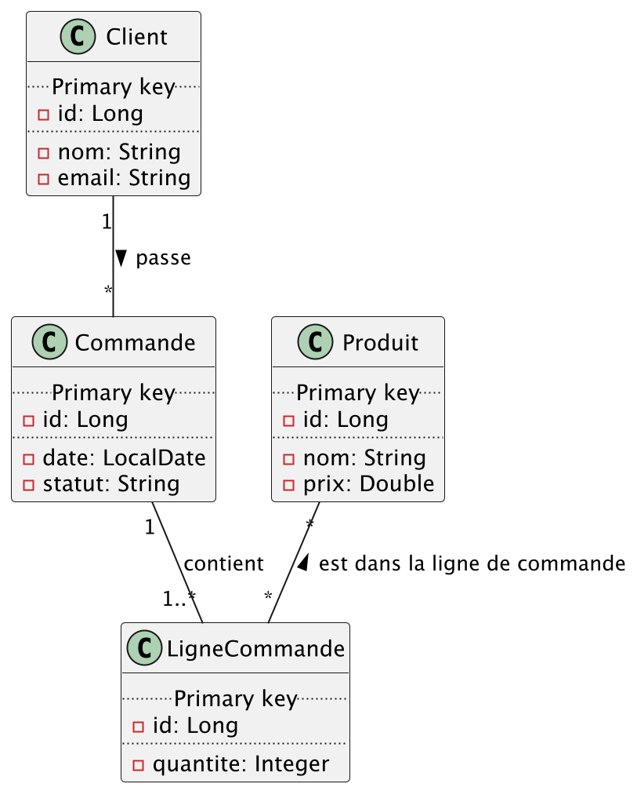

# TP1 - BIS - SPRING

Prenons la situation suivante:  


* Les entités ainsi que les répositories sont déjà implémentées.
* Les modèles d'entrée et de sortie sont déjà implémentés.
* Les exceptions utiles sont déjà implémentées.

* Vous avez des tests pour vérifier votre implémentation


## Récuperer les commandes d'un client

* Pour commencer regardons un endpoints déjà implémenter

### Définition de l'endpoint
* Dans le fichier [clientEndpoint](./rest-api/src/main/java/fr/uga/l3miage/tp1/bis/endpoints/ClientEndpoints.java)

```java
    @Operation(description = "Récupérer toutes les commandes")
    @ApiResponse(responseCode = "200", description = "Toutes les commandes d'un client")
    @ApiResponse(responseCode = "404", description = "Le client n'existe pas")
    @GetMapping("/{idClient}/commands")
    @ResponseStatus(HttpStatus.OK)
    Set<CommandResponse> getAllCommands(@PathVariable Long idClient);
```

## Implémentation du controller

* L'implémentation du controller est simple, on viens implémenter la classe du controller de [clientEndpoint](./rest-api/src/main/java/fr/uga/l3miage/tp1/bis/endpoints/ClientEndpoints.java) :
```java
@RequiredArgsConstructor
@RestController
public class ClientController implements ClientEndpoints {
    private final ClientService clientService;
    private final CommandMapper commandMapper;

    @Override
    public Set<CommandResponse> getAllCommand(Long idClient) {
        return commandMapper.toResponses(clientService.getAllCommandByClient(idClient));
    }
}
```
* On peut y voir l'implémentation de l'endpoint.

## Implémentation du service

* Dans le fichier [ClientService](./server/src/main/java/fr/uga/l3miage/tp1/bis/services/ClientService.java)

```java
@Service
@RequiredArgsConstructor
public class ClientService {
    private final ClientComponent clientComponent;
    
    public Set<Command> getAllCommandsByClient(Long idClient) {
        try {
            return clientComponent.getClient(idClient).getCommands();
        } catch (ClientEntityNotFoundException e) {
            throw new ClientNotFoundRestException(
                    e.getMessage());
        }
    }
}
```

* Ici, on voit que le service va avoir le rôle de vérification métier ou, dans ce cas, le mapping des erreurs techniques en erreurs métier afin de pouvoir répondre correctement au serveur en cas d'erreur.

## Implémentation du composant

* Dans le fichier [ClientComponent](./server/src/main/java/fr/uga/l3miage/tp1/bis/components/ClientComponent.java)

```java
@Component
@RequiredArgsConstructor
public class ClientComponent {
   private final ClientEntityRepository clientEntityRepository;
   private final ClientMapper clientMapper;
   
   public Client getClient(Long idClient) throws ClientEntityNotFoundException {
      return clientMapper.toClient(clientEntityRepository.findById(idClient)
              .orElseThrow(() -> new ClientEntityNotFoundException(String.format("Le client [%s] n'existe pas", idClient))));
   }
}
```

* C'est dans le composant que l'on a fait l'accès aux données via le repository.

## Implémentation du Mapper

* Dans le fichier [ClientMapper](./server/src/main/java/fr/uga/l3miage/tp1/bis/mappers/ClientMapper.java)

* Ensuite, il faut pouvoir passer d'un modèle à l'autre, c'est-à-dire :
   * request => entity => objet domaine => DTO
* Donc, pour cela, on utilise MapStruct de cette manière :

```java
@Mapper
public interface ClientMapper {
    
    Client toClient(ClientEntity clientEntity);
    
    ClientResponse toResponse(Client client);

    ClientEntity toEntity(ClientCreationRequest request);

    OrderedProductResponse toOrderedProductResponse(OrderedProduct orderedProduct);
}
```

## Implémentation du gestionnaire d'erreurs

* Dans le fichier [NotFoundHandler](./server/src/main/java/fr/uga/l3miage/tp1/bis/handlers/NotFoundHandler.java)
* Enfin, s'il y a une erreur métier qui apparaît, il faut pouvoir la récupérer afin de pouvoir répondre de manière compréhensible au client. Donc, on implémente un gestionnaire d'erreurs.

```java
@ControllerAdvice
public class NotFoundHandler {

    @ExceptionHandler(ClientNotFoundRestException.class)
    public ResponseEntity<ErrorResponse> handleClientNotFoundRestException(ClientNotFoundRestException ex) {
        return ResponseEntity
                .status(HttpStatus.NOT_FOUND)
                .body(ErrorResponse
                        .builder()
                        .type(ErrorType.CLIENT_NOT_FOUND)
                        .error(ex.getMessage())
                        .build()
                );
    }
}
```

* Ici, on renvoie une `ResponseEntity` afin de pouvoir choisir le statut HTTP ainsi que le modèle à renvoyer au client lorsque l'erreur métier `ClientNotFoundRestException` apparaît.

## Maintenant à vous de jouer

1. Créer un client (POST)
   * Le client doit avoir un email correct (test@test.com) 
      * la regex : `^[a-zA-Z0-9._%+-]+@[a-zA-Z0-9.-]+\.[a-zA-Z]{2,}$`  
2. Créer une commande pour un client (POST)
   * Une commande doit avoir au moins 1 produits, sinon 400
   * Les produits doivent toujours existés, sinon 404
3. Ajouter un produit à une commande (PUT)
   * La commande doit exister au préalable, sinon 404
   * Le produit doit exister, sinon 404
4. Supprimer un produit à une commande (PUT)
   * La commande doit exister au préalable, sinon 404
   * La commande ne doit pas être vide à la fin du process, sinon 400
   * Le produit concernée doit encore être dans la commande, sinon 400.

## Tester 

* Vous avez des tests à disposition pour vérifier votre implementation


