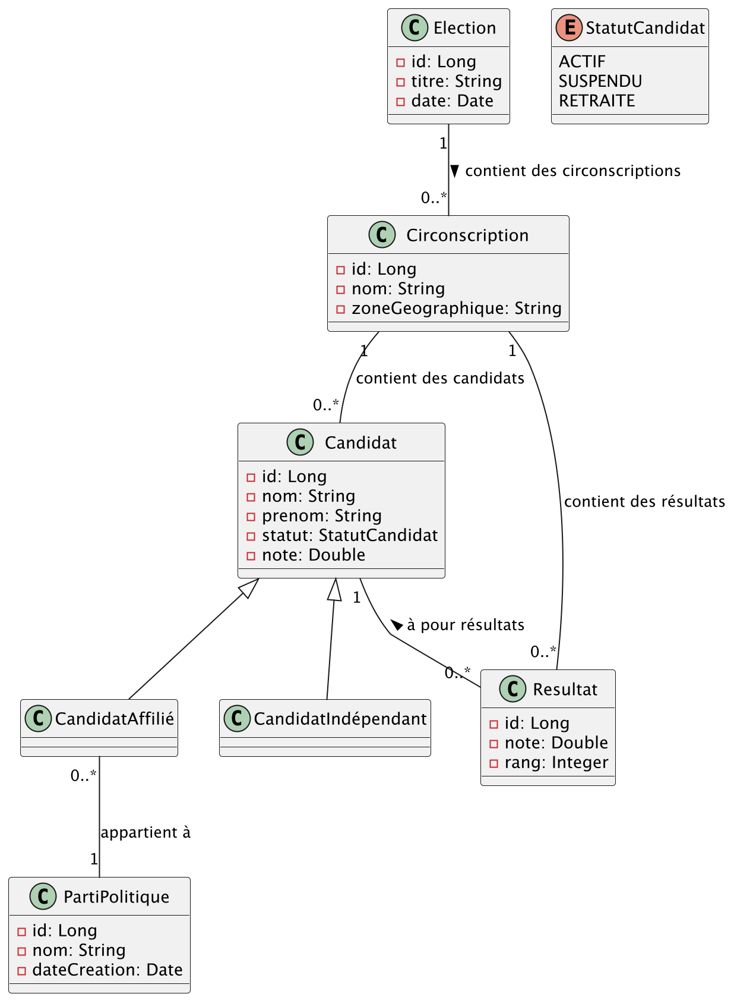

# TP1 - BIS - SPRING

Prenons la situation du Contrôle continue: 

* Les entités ainsi que les répositories sont déjà impléménter.

## A vous de jouer

1) Mettre les endpoints suivant en place avec toutes les vérifications métier possible :
    * Récupérer le gagnant d'une election. 
    * Créer une election
        * avec ses circonscriptions : 
            * Et les candidats  
    * Mettre à jour le résultat d'une election
    * Supprimer un parti politique

## Tester 

* Vous avez des tests à disposition pour vérifier votre implementation

